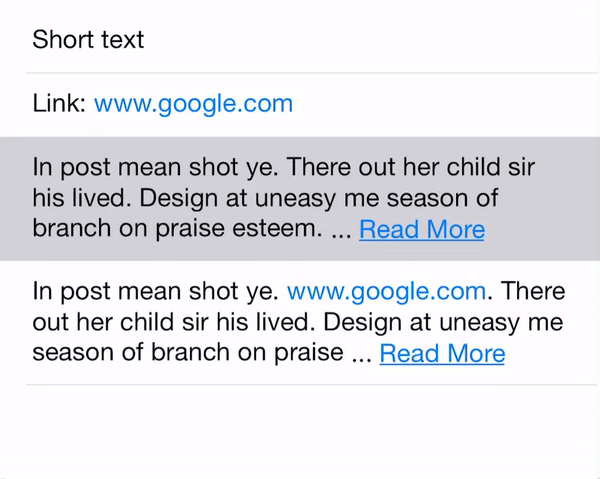

# ExpandableTextView

ExpandableTextView is a UITextView subclass that is able to hide part of the text if it is too long. In this case, it will show a link (e.g., **More**). Once the link is touched, it will expand to show the entire content. The idea and most code is ported from [ExpandableLabel](https://github.com/apploft/ExpandableLabel). One benefit of UITextView is to detect links by setting [dataDetectorTypes](https://developer.apple.com/documentation/uikit/uitextview/1618607-datadetectortypes).



# Installation

### [Carthage](https://github.com/Carthage/Carthage)

Add this to your Cartfile

```github "tianzhuqiao/ExpandableTextView"```

### [Swift Package Manager](https://swift.org/package-manager/)

* xcode->file->Add Package Dependency
  1. url: https://github.com/tianzhuqiao/ExpandableTextView
  2. branch: main


# Usage
1. import the package

```swift
import ExpandableTextView
```

2. Create an ExpandableTextView instance and customization

```swift
lazy var notesTextView : ExpandableTextView = {
        let v = ExpandableTextView()
        v.font = UIFont(name: "HelveticaNeue", size: 16)
        v.textColor = UIColor(red:0x22/255, green: 0x22/255, blue: 0x22/255, alpha: 1)
        v.backgroundColor = .clear
        v.moreText = "Read More"
        v.lessText = "Read Less"
        v.delegateExppanable = self
        v.numberOfLines = 3
        return v
    }()
```
3. Update the protocol  
```swift
    func willExpandTextView(_ textView: ExpandableTextView) {
        // before expanding
    }
    
    func didExpandTextView(_ textView: ExpandableTextView) {
        // finished expanding, update the layout if needed as the textview height may have changed
        ...
    }
    
    func willCollapseTextView(_ textView: ExpandableTextView) {
        // before collapsing
    }
    func didCollapseTextView(_ textView: ExpandableTextView) {
        // finished collapsing, update the layout if needed as the textview height may have changed
        ...
    }

    func expandableTextViewUpdateHeight(_ textView: ExpandableTextView) {
        // the ExpandableTextView height has changed (i.e., by setting its text)
        ...
    }
  
    func expandableTextView(_ textView: ExpandableTextView, shouldInteractWith URL: URL, in characterRange: NSRange, interaction: UITextItemInteraction) -> Bool {
        // check whether the specified text view allows the user interaction with the URL in the range of text
        return true
    }
```
And **expandableTextView** is same as [TextView](https://developer.apple.com/documentation/uikit/uitextviewdelegate/1649337-textview); but the tap is ignored if it is not inside a link by following the way [here](https://stackoverflow.com/a/47913329/1279096).
